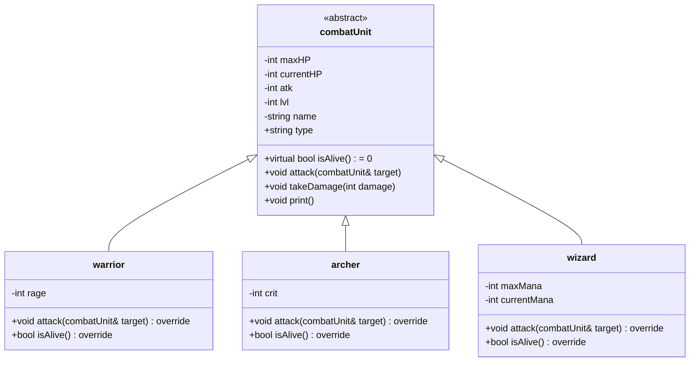

# Proyecto Integrador - Simulación de batalla

**Rafael Antonio Carrión Ortega**
**A01660812**
**Programación orientada a objetos (Gpo 851)**
**Profesor León Felipe Guevara Chávez**

# Diagrama UML del proyecto



# Planteamiento del problema

Este proyecto consiste en una simulación de batallas entre dos ejércitos, compuestos de almenos cinco unidades de combate cada uno, las cuales pueden ser una de tres distintas clases de unidades (Guerreros, Arqueros, Magos) cada una. Todas las unidades cuentan con atributos básicos (Nivel, Ataque, Vida, etc.) aparte de habilidades únicas de las clases que sean, las cuales influyen en la manera en la que se desenvuelven en combate. El objetivo es enfrentar ambos grupos en un combate hasta que se elimine a uno de ellos, quedando así un solo vencedor. NOTA: Los ejércitos se cargan desde los archivos `army1.txt` y `army2.txt`, no es posible crearlos dentro del programa una vez iniciado.

# Explicación de los conceptos de POO utilizados

### 1. Herencia

Dentro de este programa, la herencia se utilizó para crear una jerarquía de clases donde la clase abstracta `combatUnit` es de la que derivan las demás clases `warrior`, `archer` y `wizard`, permitiendo que compartan atributos y métodos comunes, mientras que dentro de cada clase derivada se implementen otros específicos a la clase.

Ejemplo:

```
class warrior : public combatUnit { ... };
class archer : public combatUnit { ... };
class wizard : public combatUnit { ... };
```

### 2. Polimorfismo

Dentro del proyecto, el polimorfismo de aplica en la sobrescritura de métodos virtuales de la clase base en las clases derivadas. Como ejemplo podemos tomar a al método `isAlive()`, el cual es un método virtual puro y se implementa de manera única en cada clase derivada:

```
// En combatUnit:
virtual bool isAlive() = 0;

// En wizard:
bool isAlive() override {
    if (getCurrentHP() > 0) return true;
    if (currentMana >= 30) {
        // Código para revivir con mana...
        return true;
    }
    return false;
}
```

### 3. Clases abstractas

La clase base combatUnit, de la cual derivan las demás, es una clase abstracta por que contiene al menos un método virtual puro (como el método `isAlive()` descrito anteriormente). Al ser un método virtual puro, se obliga a las clases derivadas a implementar dicho método y evita la instanciación directa de combatUnit.

El propósito de esto, es establecer una plantilla común para todos los personajes, asegurando que cada uno de ellos tenga su propia implementación del método.

### 4. Sobrecarga de operadores

Dentro del programa se sobrecarga el operador << para imprimir información en pantalla de una unidad de manera personalizada:

```
std::ostream& operator<<(std::ostream& os, const combatUnit& unit) {
    os << "\n=== " << unit.name << " ===\n";
    os << "Type: " << unit.type << "\n";
    // ...
    return os;
}
```

### 5. Excepciones

Dentro del archivo principal `exercise.cpp`, se utilizaron excepciones para poder manejar de mejor manera posibles errores, como por ejemplo, durante la carga de archivos:

```
void loadArmy(std::vector<std::unique_ptr<combatUnit>>& army, const std::string& filename) {
    std::ifstream file(filename);
    if (!file.is_open()) {
        throw std::runtime_error("Error while trying to open file: " + filename);
    }
    // ...
}
```

# Conclusión

Este proyecto fue bastante interesante, además de que me dejó aplicar todos los conceptos aprendidos en clase de manera útil y lógica. Me permitió practicar y aprender de mis errores, expandiendo mis aprendizajes más allá de la clase. La implementación de distintos tipos de personajes volvió más divertido de escribir el programa, dando muchas oportunidades para experimentar e ir mejorando/agregando al código cada día. Si bien, todavía se me dificultan ciertas cosas (como sintaxis en ciertos aspectos, o resolución de problemas lógicos eficientemente), me apoyé más de lo que me gustaría de la IA implementada en VS Code y me hubiera gustado tener dentro de mi capacidad hacer un proyecto más interesante y con más interacción, lo cierto es que con esta clase y este proyecto he aprendido como nunca, y me emociona el imaginarme que tipo de proyectos estaré desarrollando en 5 o 10 años.

# Referencias

- Object Oriented Design (OOD): https://www.geeksforgeeks.org/system-design/oops-object-oriented-design/

- Object Oriented Programming in C++: https://www.geeksforgeeks.org/cpp/object-oriented-programming-in-cpp/

- C++ (w3schools): https://www.w3schools.com/cpp/

- Instrucciones try, throw y catch (C++): https://learn.microsoft.com/es-es/cpp/cpp/try-throw-and-catch-statements-cpp?view=msvc-170


